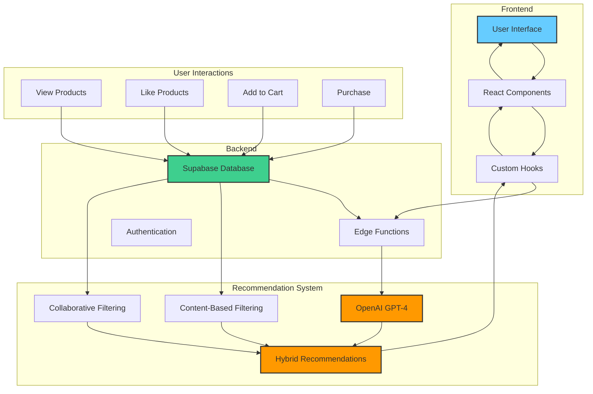

# 🧠 AI-Powered Recommendation System

This document provides a detailed explanation of the recommendation system implemented in the Amazon Style e-commerce platform.

## 📊 System Architecture

The recommendation system combines multiple approaches to deliver highly personalized product suggestions:



## 🔍 Recommendation Approaches

### 1. OpenAI-Powered Recommendations

We leverage OpenAI's GPT-4 model to analyze user behavior patterns and generate intelligent product recommendations:

#### Implementation Details

```typescript
// Supabase Edge Function that connects to OpenAI
import { serve } from 'https://deno.land/std@0.168.0/http/server.ts'
import { createClient } from 'https://esm.sh/@supabase/supabase-js@2'
import { Configuration, OpenAIApi } from 'https://esm.sh/openai@3.2.1'

serve(async (req) => {
  const { userId } = await req.json()
  
  // Initialize Supabase client
  const supabaseClient = createClient(
    Deno.env.get('SUPABASE_URL') ?? '',
    Deno.env.get('SUPABASE_SERVICE_ROLE_KEY') ?? ''
  )
  
  // Initialize OpenAI
  const configuration = new Configuration({
    apiKey: Deno.env.get('OPENAI_API_KEY'),
  })
  const openai = new OpenAIApi(configuration)
  
  // Fetch user interactions and products
  const { data: userInteractions } = await supabaseClient
    .from('user_interactions')
    .select('*')
    .eq('user_id', userId)
  
  const { data: products } = await supabaseClient
    .from('products')
    .select('*')
  
  // Create prompt for OpenAI
  const prompt = {
    model: "gpt-4",
    messages: [
      {
        role: "system",
        content: "You are a recommendation system expert. Generate product recommendations based on user behavior and product catalog."
      },
      {
        role: "user",
        content: `Generate recommendations based on user behavior: ${JSON.stringify(userInteractions)}`
      }
    ]
  }
  
  // Get recommendations from OpenAI
  const completion = await openai.createChatCompletion(prompt)
  const recommendations = JSON.parse(completion.data.choices[0].message.content)
  
  return new Response(
    JSON.stringify({ recommendations }),
    { headers: { 'Content-Type': 'application/json' } }
  )
})
```

#### Key Features

- **Contextual Understanding**: GPT-4 can understand complex relationships between products and user behavior
- **Natural Language Reasoning**: Can provide human-readable explanations for recommendations
- **Cold Start Handling**: Can generate recommendations even with limited user data
- **Adaptability**: Automatically adapts to changing user preferences

### 2. Content-Based Filtering

This approach recommends products similar to those the user has previously interacted with:

#### Implementation Details

```typescript
const generateContentBasedRecommendations = (products: Product[], interactions: any[]): RecommendationScore[] => {
  const interactedProductIds = new Set(interactions.map(i => i.product_id));
  const likedProducts = interactions.filter(i => i.interaction_type === 'like');
  
  // Get categories and brands of liked products
  const likedCategories = new Set(
    likedProducts.map(i => products.find(p => p.id === i.product_id)?.category).filter(Boolean)
  );
  const likedBrands = new Set(
    likedProducts.map(i => products.find(p => p.id === i.product_id)?.brand).filter(Boolean)
  );

  return products
    .filter(p => !interactedProductIds.has(p.id))
    .map(product => {
      let score = 0;
      let reason = 'Based on your preferences';

      // Category match
      if (likedCategories.has(product.category)) {
        score += 3;
      }

      // Brand match
      if (likedBrands.has(product.brand)) {
        score += 2;
      }

      // Rating boost
      score += product.rating;

      return {
        productId: product.id,
        score,
        reason
      };
    })
    .sort((a, b) => b.score - a.score);
};
```

#### Key Features

- **Personalized**: Based on the user's own preferences
- **Transparent**: Clear reasoning for recommendations
- **No Cold Start Problem**: Works even with a single user
- **Domain Knowledge**: Utilizes product metadata effectively

### 3. Collaborative Filtering

This method identifies patterns across users with similar tastes:

#### Implementation Details

```typescript
const generateCollaborativeRecommendations = (products: Product[], interactions: any[]): RecommendationScore[] => {
  const interactedProductIds = new Set(interactions.map(i => i.product_id));
  
  // Simple collaborative filtering based on category preferences
  const categoryInteractions: Record<string, number> = {};
  
  interactions.forEach(interaction => {
    const product = products.find(p => p.id === interaction.product_id);
    if (product) {
      const weight = interaction.interaction_type === 'like' ? 3 : 
                    interaction.interaction_type === 'cart' ? 2 : 1;
      categoryInteractions[product.category] = (categoryInteractions[product.category] || 0) + weight;
    }
  });

  return products
    .filter(p => !interactedProductIds.has(p.id))
    .map(product => {
      const categoryScore = categoryInteractions[product.category] || 0;
      const popularityScore = Math.log(product.reviewCount + 1) / 10;
      const ratingScore = product.rating / 5;
      
      const score = categoryScore * 0.5 + popularityScore * 0.3 + ratingScore * 0.2;
      
      return {
        productId: product.id,
        score,
        reason: 'Popular in your categories'
      };
    })
    .sort((a, b) => b.score - a.score);
};
```

#### Key Features

- **Community Wisdom**: Leverages patterns across users
- **Serendipity**: Can discover unexpected but relevant items
- **Popularity Awareness**: Considers product popularity and ratings
- **Category Focus**: Emphasizes categories the user has shown interest in

### 4. Hybrid Approach

Our system combines all three methods for optimal recommendations:

#### Implementation Details

```typescript
const combineRecommendations = (contentBased: RecommendationScore[], collaborative: RecommendationScore[]): RecommendationScore[] => {
  const combined: Record<string, RecommendationScore> = {};

  // Add content-based recommendations with weight
  contentBased.forEach(item => {
    combined[item.productId] = {
      productId: item.productId,
      score: item.score * 0.6,
      reason: 'Based on preferences and popularity'
    };
  });

  // Add collaborative recommendations with weight
  collaborative.forEach(item => {
    if (combined[item.productId]) {
      combined[item.productId].score += item.score * 0.4;
    } else {
      combined[item.productId] = {
        productId: item.productId,
        score: item.score * 0.4,
        reason: item.reason
      };
    }
  });

  return Object.values(combined).sort((a, b) => b.score - a.score);
};
```

#### Key Features

- **Best of All Worlds**: Combines strengths of multiple approaches
- **Weighted Scoring**: Prioritizes the most relevant products
- **Fallback Mechanisms**: If one approach fails, others can compensate
- **Comprehensive Coverage**: Addresses both personalization and discovery

## 📊 User Interaction Tracking

The recommendation system relies on tracking user interactions to build a profile of user preferences:

### Tracked Interactions

```typescript
// Interaction types for tracking user behavior
export enum InteractionType {
  VIEW = 'view',
  LIKE = 'like',
  CART = 'cart',
  PURCHASE = 'purchase'
}

// Track a user interaction with a product
export async function trackInteraction(
  userId: string,
  productId: string,
  interactionType: InteractionType
) {
  if (!userId || !productId) return;

  try {
    // Check if this interaction already exists
    const { data: existingInteraction } = await supabase
      .from('user_interactions')
      .select('*')
      .eq('user_id', userId)
      .eq('product_id', productId)
      .eq('interaction_type', interactionType)
      .single();

    if (existingInteraction) {
      // Update the existing interaction
      await supabase
        .from('user_interactions')
        .update({ 
          interaction_count: (existingInteraction.interaction_count || 0) + 1,
          last_interacted_at: new Date().toISOString() 
        })
        .eq('id', existingInteraction.id);
    } else {
      // Create a new interaction
      await supabase.from('user_interactions').insert({
        user_id: userId,
        product_id: productId,
        interaction_type: interactionType,
        interaction_count: 1,
        last_interacted_at: new Date().toISOString()
      });
    }
  } catch (error) {
    console.error('Error tracking interaction:', error);
  }
}
```

### Database Schema

```sql
-- Create user_interactions table
CREATE TABLE public.user_interactions (
  id UUID DEFAULT gen_random_uuid() PRIMARY KEY,
  user_id UUID REFERENCES auth.users(id) ON DELETE CASCADE,
  product_id UUID REFERENCES public.products(id) ON DELETE CASCADE,
  interaction_type TEXT NOT NULL CHECK (interaction_type IN ('view', 'like', 'cart', 'purchase')),
  interaction_count INTEGER DEFAULT 1,
  rating DECIMAL(3,2),
  last_interacted_at TIMESTAMP WITH TIME ZONE DEFAULT NOW(),
  created_at TIMESTAMP WITH TIME ZONE DEFAULT NOW(),
  UNIQUE(user_id, product_id, interaction_type)
);
```

## 🔄 Recommendation Flow

1. **User Interaction**: User views, likes, or adds products to cart
2. **Data Tracking**: Interactions are stored in the Supabase database
3. **Recommendation Generation**:
   - Content-based filtering analyzes user's own preferences
   - Collaborative filtering identifies patterns across users
   - OpenAI analyzes complex relationships and generates insights
   - Hybrid approach combines all recommendations
4. **Presentation**: Recommendations are displayed to the user with explanations
5. **Feedback Loop**: User interactions with recommendations improve future suggestions

## 📈 Performance Considerations

### Caching Strategy

To improve performance and reduce API calls:

```typescript
// Cache duration in milliseconds (30 minutes)
const CACHE_DURATION = 30 * 60 * 1000;

// Check cache first
const cachedRecommendations = localStorage.getItem(`ai_recommendations_${user.id}`);
if (cachedRecommendations) {
  const { recommendations, timestamp } = JSON.parse(cachedRecommendations);
  if (Date.now() - timestamp < CACHE_DURATION) {
    setRecommendations(recommendations);
    return;
  }
}
```

### OpenAI Token Optimization

To minimize costs and improve response times:

- Limit the number of user interactions sent to OpenAI
- Focus on the most recent and relevant interactions
- Use a concise prompt format
- Implement proper error handling and retries

## 🚀 Future Enhancements

1. **A/B Testing Framework**: Compare different recommendation algorithms
2. **Real-time Recommendations**: Update recommendations as user browses
3. **Multi-modal Recommendations**: Consider images and text descriptions
4. **Contextual Awareness**: Consider time of day, season, and current events
5. **Explainable AI**: Provide more detailed explanations for recommendations 